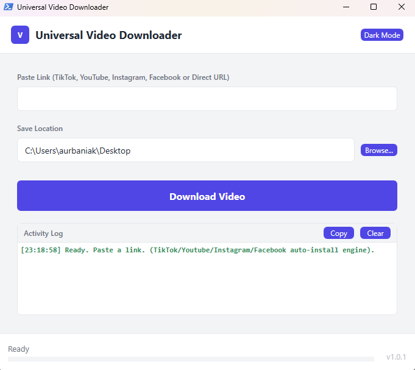
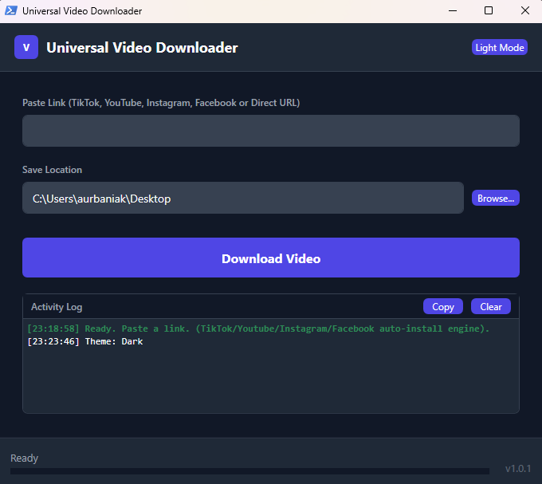

 

> 🎬✨ Fast, clean downloads with a modern WPF UI.

# Universal Video Downloader

Universal Video Downloader is a Windows PowerShell 5.1 script with a modern WPF interface for saving media from popular platforms. It acts as a smart wrapper that auto-installs **yt-dlp** and **FFmpeg** to handle complex downloads from YouTube, Instagram, and Facebook, while providing direct API flows for TikTok and general media links.

Now supports **Audio Extraction** (MP3/WAV/M4A), **Resolution Selection** (4K, 1080p, etc.), and **MP4 Merging**.

# UI Presentation

### Light Mode ☀️


### Dark Mode 🕶️


*(Note: Screenshots may differ slightly from the latest version)*

## Features 🚀

* **Modern WPF UI**: Clean interface with Light/Dark theme toggle and inline logging.
* **Multi-Engine Support**: Seamlessly uses `yt-dlp` for major sites and specialized APIs (TikWM, Cobalt) for others.
* **Audio Extraction**: Download audio only with format selection (**MP3**, **WAV**, **M4A**, or **Best**).
* **Resolution Control**: Choose your preferred video quality for YouTube links (e.g., **4K**, **1080p**, **720p**).
* **Smart Merging**: Automatically downloads the best video and audio streams and merges them into a compatible **MP4** container.
* **Stop Button**: Cancel active downloads immediately with a dedicated Stop button.
* **Auto-Setup**: Automatically downloads and configures `yt-dlp.exe` and `ffmpeg.exe` in a temporary folder—no manual installation required.
* **Self-Cleaning**: Removes temporary tools and files after the application closes.

## Requirements 📋

* Windows with **PowerShell 5.1** (WPF requires full .NET Framework).
* Internet access to fetch tools (`yt-dlp`, `ffmpeg`) and media content.

## Project Structure 📂

* `universal-video-downloader.ps1`: Entry point that loads the XAML window, wires up UI events, and delegates to helper modules.
* `src/MainWindow.xaml`: Defines the WPF window layout, including the new Audio/Resolution controls and Stop button.
* `src/Utilities.ps1`: General helpers for UI styling, safe filenames, and URL normalization.
* `src/Logging.ps1`: Log buffer management, UI rendering, and clipboard controls.
* `src/Downloaders.ps1`: Core logic for:
    * Bootstrapping `yt-dlp` and `ffmpeg`.
    * Handling platform-specific downloads (YouTube, TikTok, etc.).
    * Managing download cancellation/stopping.

## Key Functions ⚙️

### Utilities
* `Get-Brush`, `Clean-FileName`: UI and file-safety helpers.
* `Normalize-Url`: Cleans and validates user input.

### Logging
* `Add-Log`: Adds timestamped, color-coded entries (Green for success, Red for errors).

### Downloaders
* `Install-YtDlp` / `Install-FFmpeg`: Auto-downloads essential tools to `%TEMP%` if missing.
* `Download-Native-YtDlp`: Handles YouTube/Social media downloads. Supports `--extract-audio` for audio mode and `--merge-output-format mp4` for video.
* `Download-TikTok`: Uses the TikWM API for watermark-free TikTok videos or audio.
* `Download-File-WithProgress`: Generic downloader with speed/size tracking and cancellation support.

## Usage 🎮

1.  Open **PowerShell 5.1** and run the script:
    ```powershell
    ./universal-video-downloader.ps1
    ```
2.  Paste a video URL (YouTube, TikTok, Instagram, Facebook, etc.).
3.  **Customize Options**:
    * **Video Mode**: If it's a YouTube link, a dropdown appears to select resolution (Best, 4K, 1080p, etc.).
    * **Audio Mode**: Check **"Audio Only"** to download sound. Select your desired format (MP3, WAV, M4A) from the adjacent dropdown.
4.  Click **Download**.
5.  (Optional) Click **Stop** to cancel the process at any time.

## Notes 📝

* The script uses a temporary directory for tools. `yt-dlp` and `ffmpeg` are downloaded once per session (or reused if found) and cleaned up upon exit.
* Conversion to MP3 or WAV requires `ffmpeg`, which the script handles automatically.